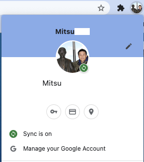
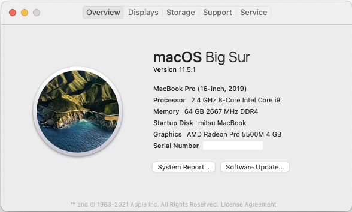

.. about Chromium

########################
オープンソース版 Chrome
########################

Google Chrome WEBブラウザのオープンソース版 Chromium について記述する予定です。

************
インストール
************

****
設定
****

********************
同期ができなくなった
********************

Google Chrome のオープンソース版の Chromium で

これが出来なくなった。

2021年03月15日から、 `Chromium`_ などでは、Googleアカウントのデータ同期が出来なくなった ＝ ブックマークなどの共有ができない。

`Limiting Private Api availability in Chromium`_ に、「2021年3月15日から プライベート Chrome API に制限をかける」と有ります。

 We are limiting access to our private Chrome APIs starting on March 15, 2021.

解決策は、

* 手動の同期
  * `My Google Activity`_ から `Google Takeout`_ を使う
* Chrome ブラウザを利用する
    * Linux用は *Intel CPU* は、ダウンロード可能
    * Raspberry Pi が採用している ARM アーキテクチャ用は **無し**
* Chromium を自分用に作成する
    * ソースコードの入手 `Get the code`_
    * ビルド手順 `Build Instructions`_
        * 必需品：16GB RAM推奨、100GB の空きディスク、Git と Python v3

なので、かなり面倒ですが **手動** の動機を選びました。

======================================
intel Mac で ARM用 Chromium をビルド
======================================

* `Mac Build Instructions`_
* `Chromium for Arm Macs`_
* `Update on Google API usage in Chromium`_
* `How GN handles cross-compiling`_
* `API Keys`_

を参考にビルドしてみた。
結果は、**まだ** Intel macOS で ARM64 Linux の Chromium は生成できなかった (^ ^;

-----------------------------------
Get the code　(ソースコードの取得)
-----------------------------------

`fetch` の 1回目は、 `too many open files` で失敗した。

.. code-block:: shell

  failed to read "/Users/mitsu/Develop/git/googlesource/chromium/src/components/ssl_errors": fcntl: too many open files
  Error: Command 'python3 src/testing/generate_location_tags.py --out src/testing/location_tags.json' returned non-zero exit status 1 in /Users/mitsu/Develop/git/googlesource/chromium
  failed to read "/Users/mitsu/Develop/git/googlesource/chromium/src/components/ssl_errors": fcntl: too many open files

  Hook 'python3 src/testing/generate_location_tags.py --out src/testing/location_tags.json' took 12.13 secs
  Subprocess failed with return code 2.

Atom で開いているファイルを5個くらい閉じて、 2回目で成功した。実行時間は 13分52秒だった。

-----------------------------------
Setting up the build (ビルドの設定)
-----------------------------------

`gn gen out/pi4arm64` を実行すると `vi` 系エディタが起動するので **Faster builds** の設定、クロスコンパイルの設定と、 `API Keys`_ の **Acquiring Keys** の手順を行い `client ID` 、 `client secret` も設定した。以下は、*out/pi4arm64/args.gn* の設定内容で有る。

.. code-block:: config

  # Set build arguments here. See `gn help buildargs`.
  is_debug = false
  is_component_buils = true
  symbol_level = 0
  current_os = "mac"
  current_cpu = "x64"
  target_os = "linux"
  target_cpu = "arm64"
  google_api_key = "your_api_key"
  google_default_client_id = "your_client_id"
  google_default_client_secret = "your_client_secret"

--------------
Build Chromium
--------------

次のコマンドで Chromium をビルドする。

.. code-block:: language

  autoninja -C out/pi4arm64 chrome

81,658 ファイルのビルドが始まります。

実績値

- １回目 CCache 無効：5時間49分29秒 (target_os 指定忘れ)
- ２回目 CCache 有効：時間分秒 (target_os `linux`)
    - Intel mac では Linux/ARM64 は未だ NG

.. code-block:: shell

  gn gen --check out/pi4arm64
  ERROR copy_bundle_data tool not defined
  The toolchain //build/toolchain/linux:clang_arm64
  used by target //components/policy:chrome_manifest_bundle
  doesn't define a "copy_bundle_data" tool.

----------------------
create install package
----------------------

.. code-block:: shell

  chrome/installer/linux/debian/build.sh out/pi4arm64/

----

.. _Chromium: https://www.chromium.org/Home
.. _Limiting Private Api availability in Chromium: https://blog.chromium.org/2021/01/limiting-private-api-availability-in.html
.. _My Google Activity: https://myactivity.google.com/myactivity?pli=1
.. _Google Takeout: https://takeout.google.com/?pli=1
.. _Get the code: https://chromium.googlesource.com/chromium/src/+/refs/heads/main/docs/get_the_code.md
.. _Build Instructions: https://chromium.googlesource.com/chromium/src/+/refs/heads/main/docs/linux/build_instructions.md
.. _Mac Build Instructions: https://chromium.googlesource.com/chromium/src/+/refs/heads/main/docs/mac_build_instructions.md
.. _Chromium for Arm Macs: https://chromium.googlesource.com/chromium/src.git/+/main/docs/mac_arm64.md
.. _How GN handles cross-compiling: https://gn.googlesource.com/gn/+/refs/heads/main/docs/cross_compiles.md
.. _Update on Google API usage in Chromium: https://www.mail-archive.com/freebsd-chromium@freebsd.org/msg03856.html
.. _API Keys: https://www.chromium.org/developers/how-tos/api-keys